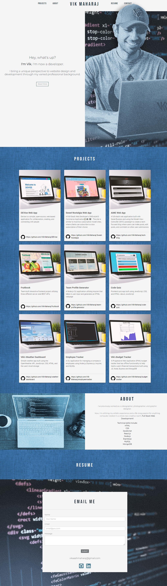

# Vik Maharaj's Web Portfolio (React)

## Description

An online portfolio is an essential tool for a developer. Being able to show off finished projects and demonstrate coding proficiency is a critical part of the job-seeking process.

Enter the purpose of this project: take an existing portfolio website (previously built entirely with HTML and CSS) and revise it using React.js. By doing this, it allows the portfolio to be more versatile, with reusable pieces, and with a more robust and functional "Projects" section that can be easily updated.

The portfolio contains the following features:

- At the top of the webpage, the page loads with name and links to various sections of the page—all created with react components and navigated using React Router.
- The Projects section of the website (built with cards from the Material UI library) features images of the work samples, and depending where it is clicked, takes the user to the selected deployed website or to the GitHub repo of the selected project.
- The contact section has external links to LinkedIn and GitHub profiles, along with an email form for future use.

Link to the deployed website: vik-maharaj.github.io/react-portfolio/



## Installation

To install this application, first clone the repo to your local machine. Then, you will need to install the node dependencies/modules which can be done by running the ```npm install``` command in your terminal/bash shell. 


## Usage

Once the dependencies are installed, to use the application, initialize the server with the following command, ```npm run start```, and it can then be opened locally (or accessed any time via the above deployed site url).


## Credits

Collaborators include the instructor, TAs, and fellow classmates of the UCF Coding Bootcamp (Spring 2022).

Other resources include www.w3schools.com and www.stackoverflow.com.


## License

Copyright (c) 2022 Vik Maharaj

Permission is hereby granted, free of charge, to any person obtaining a copy of this software and associated documentation files (the "Software"), to deal in the Software without restriction, including without limitation the rights to use, copy, modify, merge, publish, distribute, sublicense, and/or sell copies of the Software, and to permit persons to whom the Software is furnished to do so, subject to the following conditions:

The above copyright notice and this permission notice shall be included in all copies or substantial portions of the Software.

THE SOFTWARE IS PROVIDED "AS IS", WITHOUT WARRANTY OF ANY KIND, EXPRESS OR IMPLIED, INCLUDING BUT NOT LIMITED TO THE WARRANTIES OF MERCHANTABILITY,
FITNESS FOR A PARTICULAR PURPOSE AND NONINFRINGEMENT. IN NO EVENT SHALL THE AUTHORS OR COPYRIGHT HOLDERS BE LIABLE FOR ANY CLAIM, DAMAGES OR OTHER LIABILITY, WHETHER IN AN ACTION OF CONTRACT, TORT OR OTHERWISE, ARISING FROM, OUT OF OR IN CONNECTION WITH THE SOFTWARE OR THE USE OR OTHER DEALINGS IN THE SOFTWARE.


## Badges


[](https://opensource.org/licenses/MIT)